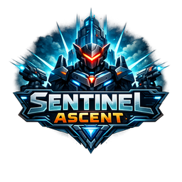

# Sentinel Ascent

A radial survival-defense incremental for PC and tablet. Single-player. No microtransactions. Saves are local.

A stationary Sentinel at the center of the Grid auto-fires at escalating cycles of hostile drones and constructs. The player invests Scrip during the run, then layers permanent progression across the Forge, Research Bay, Protocols, Augments, Arsenals, Constructs, Heirlooms, the Order, the Warden, and the Archive tech tree.



## Status

**v0.1.0 — Closed alpha (Phase 17 of the build roadmap).**

All 17 planned phases have shipped. The complete design / system / build documentation is in [`docs/my_game/`](docs/my_game/). Latest build state: [`docs/my_game/12-progress-log.md`](docs/my_game/12-progress-log.md). Beta tester guide: [`docs/my_game/13-beta-tester-guide.md`](docs/my_game/13-beta-tester-guide.md).

- 173/173 unit tests passing
- TypeScript strict mode clean
- Schema v10 with full forward-only migration chain v1 → v10
- Deterministic 60 Hz fixed-step simulation with byte-identical mid-run snapshot resume
- Web (PWA) + native desktop (Tauri 2) from one codebase

## Install

### PWA (browser, all platforms)

Open the deployed URL in a desktop browser, Android Chrome, or iOS Safari, then **Install app** / **Add to Home Screen** for a standalone window. Saves persist locally via IndexedDB.

### Desktop (Tauri)

Pre-built installers attached to each [GitHub release](../../releases):

- **Windows**: `Sentinel Ascent_0.1.0_x64_en-US.msi`
- **macOS**: `Sentinel Ascent_0.1.0_aarch64.dmg` (Apple Silicon) or `_x64.dmg` (Intel)
- **Linux**: `sentinel-ascent_0.1.0_amd64.deb` or `Sentinel Ascent_0.1.0_amd64.AppImage`

## Build from source

```bash
cd app
npm install
npm run dev          # Vite dev server at localhost:5173
npm run tauri:dev    # Native desktop window via Tauri
npm test             # Vitest unit suite
npm run typecheck    # TypeScript strict
npm run build        # PWA production bundle to app/dist/
npm run tauri:build  # Native installer in app/src-tauri/target/release/bundle/
```

Per-OS bundle scripts:

```bash
npm run tauri:build:win    # MSI + NSIS
npm run tauri:build:mac    # DMG + .app
npm run tauri:build:linux  # DEB + AppImage
```

## Stack

TypeScript · React 18 · PixiJS 8 · Zustand · IndexedDB (`idb`) · Vite 6 · vite-plugin-pwa · Tauri 2 · Vitest · Playwright

No game engine. The renderer is PixiJS (a 2D library, not an engine). The simulation is hand-written for deterministic replay.

## Privacy

Everything stays on your device. There is no backend. No ads, no tracking pixels, no account required. Telemetry is **opt-in only** and never leaves your machine — the game queues events locally; you click **Download JSON** in Settings to attach them to a bug report manually.

## Documentation

The complete design / system / implementation specification is in [`docs/my_game/`](docs/my_game/) — 13 documents covering core runtime, enemies, visual style, progression, currencies, architecture, save system, auto-procurement, input/platform, design system, build roadmap, progress log, and beta-tester onboarding.

## License

This project is the original work of the listed contributors. See `LICENSE`.

The IP-renamed-for-distinction pattern (every proper noun rebranded; no microtransaction pathways; single-player conversions of multiplayer systems; 5-slot save system; researchable auto-buy) is documented in [`docs/my_game/00-handoff-index.md`](docs/my_game/00-handoff-index.md).
